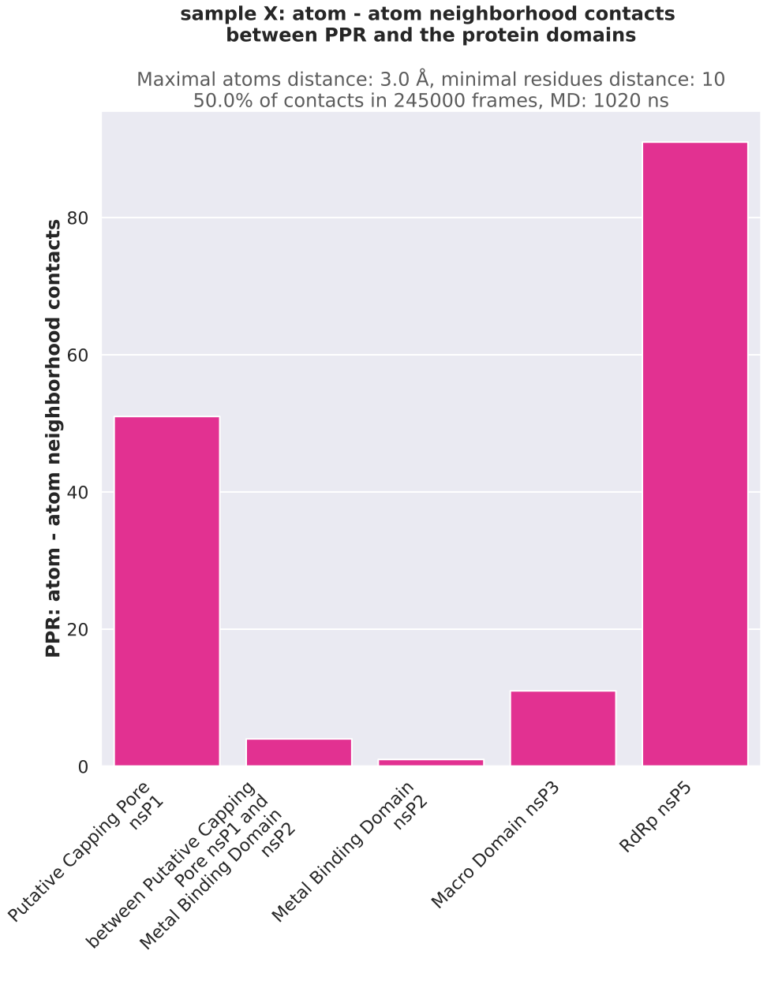
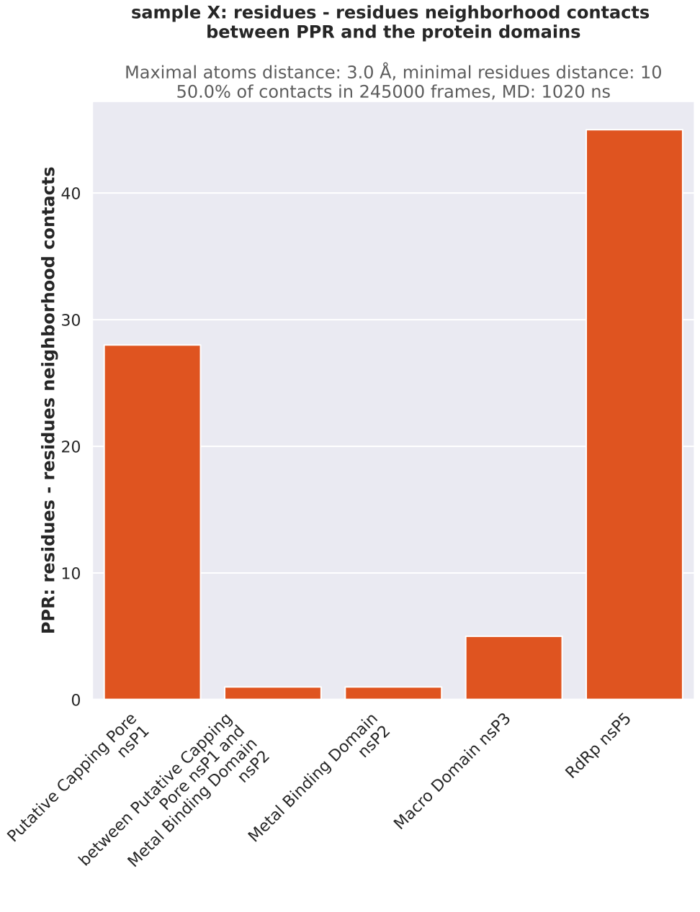

# Plot neighbors

From a CSV file of neighborhood contacts, a domain CSV file and a YAML parameters file, generated by the script 
[trajectories_neighbors](https://github.com/njeanne/trajectories_neighbors), together with a defined Region of Interest 
(ROI), the workflow produces a CSV file listing the domains in contact, as well as plots of neighborhood contacts 
(by atoms and by residues).

The data directory contains the test files:
- `sample-X_neighbors.csv`: the neighborhood contacts results (produced by the trajectory_neighbors script).
- `sample-X_analysis.yaml`: the neighborhood contacts analysis parameters (produced by the trajectory_neighbors script).
- `sample-X_domains.csv`: the protein domain coordinates.

## Conda environment

A [conda](https://docs.conda.io/projects/conda/en/latest/index.html) YAML environment file is provided: 
`conda_env/python3_env.yml`. The file contains all the dependencies to run the script.
The conda environment is generated using the command:
```shell script
# create the environment
conda env create -f conda_env/python3_env.yml

# activate the environment
conda activate python3
```

## Usage

The script can be tested with the test data provided in the `data` directory, the commands are:

```shell script
conda activate python3

./plot_neighbors.py --format svg --roi 714-801 --proportion 50.0 --residues-distance 10 --out results/sample-X \
--domains data/sample-X_domains.csv --parameters data/sample-X_analysis.yaml data/sample-X_neighbors.csv

conda deactivate
```

## Outputs

The script outputs are:

- A CSV file containing the neighborhood contacts of the region of interest across the entire protein.
- 2 plots of the region of interest neighborhood contacts, by atoms and by residues:





